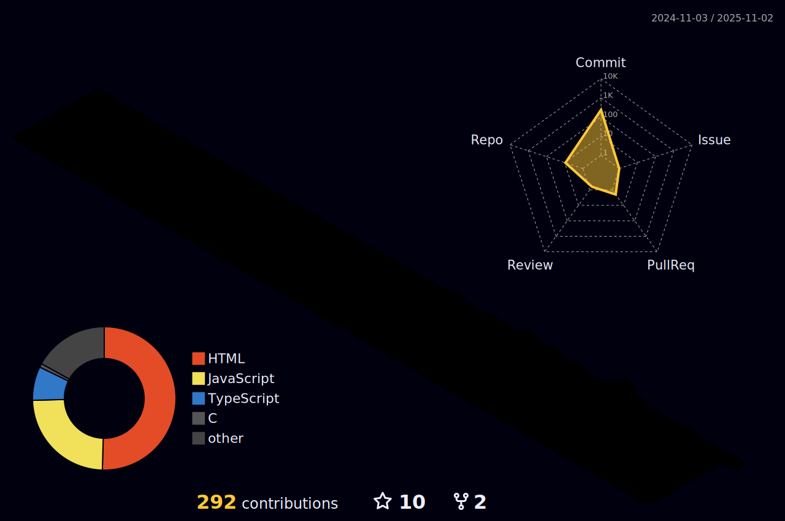

## Hola 👋

My name is Suraj, and I'm a computer science student studying in Tribhuvan University currently interested in Software Engineering and AI!

- 🔭 I’m currently improving my personal skills!
- 🌱 Learning Full Stack Development and Data Structure & Algorithm.
- 👯 Looking to collaborate on anything related to my feild.
  - Connect with me on suraj.here@outlook.com

I write sometimes, mostly about tech and personal experiences on [Medium](https://medium.com/@itsmesuraj)

